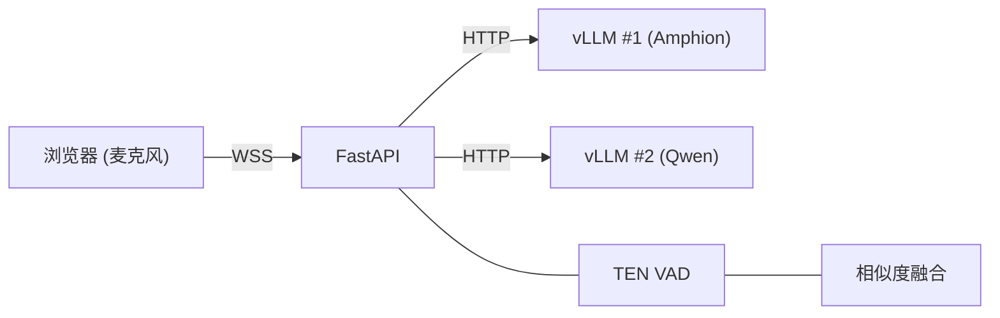

# AudioLLM Server

[](LICENSE)

基于 [Amphion](https://github.com/open-mmlab/Amphion) (vLLM) 的实时语音多任务 Demo，集成 TEN VAD 语音端点检测。
支持两类任务：

- 实时语音转写（双 ASR 模型 Amphion + Qwen 并行推理 + 归一化质量评估 + 风险感知融合，可选在每条转写旁附上情感/语气）
- 情感识别（SER 8 分类 / SEC 自由文本描述，整段语音推理）

前端两个 Demo 页面（ASR / 情感）共享同一套侧边栏导航与 EN / 中文 实时语言切换。

---

## 环境要求

- Python 3.10+
- 已启动的 vLLM 推理服务（兼容 OpenAI API）
- OpenSSL（用于生成自签名证书）
- 可选：用于"长文本热词抽取"功能的外部 LLM（OpenAI 兼容接口），配置文件 `backend/api.json`

## 快速开始

```bash
# 安装依赖（二选一）
pip install -e .
uv sync

# 编辑服务端配置（vLLM 地址、模型名等）
vim backend/config.json

# 可选：配置长文本热词抽取使用的 LLM（仅在前端"从文本抽取热词"功能用到）
cp backend/api.json.example backend/api.json && vim backend/api.json

# 启动服务
bash start.sh
```

浏览器打开 `http://172.16.0.3:8080`（systemd 部署）或 `https://172.16.0.3:8443`（`bash start.sh` 自签 HTTPS）进入实时 ASR Demo，另一个 Demo 入口：

| 页面 | 路径 | 说明 |
|---|---|---|
| 实时语音转写 | / 或 /index.html | 双 ASR 模型并行 + 融合；右侧面板可开启"情感识别"开关，在每条 final 转写下附上情绪与语气 |
| 情感识别 | /emotion.html | 整段语音 SER / SEC |

页面右上角的 EN / 中 切换会持久化到浏览器 localStorage，下次访问保持上次的选择。

> 首次访问时浏览器会提示自签名证书不安全，点击 **高级** → **继续访问** 即可。

---

## 前端样式重建（Tailwind）

前端三个 Demo 页面共用一份 **预编译** 的 Tailwind 工具类样式 `frontend/tailwind.css`（已入仓），运行时不再依赖 `cdn.tailwindcss.com` 的 JIT 脚本，跨页切换不会再有"重新跑一遍 Tailwind 编译"的卡顿。

仅当你修改了 `frontend/*.html` 或 `frontend/*.js` 中使用的 Tailwind 类名（包括 JS 字符串里拼接出来的 `lg:w-[380px]` 等动态类）后，需要重新生成一次：

```bash
bash scripts/build_tailwind.sh           # 一次性构建
bash scripts/build_tailwind.sh --watch   # 监听文件改动持续构建
```

脚本通过 `npx tailwindcss@3` 调用 Tailwind v3 CLI，按 `frontend/tailwind.config.js` 中声明的 content 范围扫描，并写出压缩后的 `frontend/tailwind.css`。需要本机已安装 Node.js (>= 18) 和 npm。

如果你新增了 Tailwind 类却忘了重建，浏览器只会回退到没有该类的默认样式（不会报错），需要重新运行脚本。

---

## 系统架构



| 模块 | 说明 |
|---|---|
| **前端** | Web Audio API AudioWorklet 采集 16 kHz PCM，通过 WebSocket 发送 |
| **后端** | FastAPI，每个连接启动两个并发异步任务：VAD 任务（语音检测）+ LLM 任务（ASR 推理），互不阻塞 |
| **热词** | 在浏览器 UI 中管理，通过 WebSocket 实时同步到后端 |

---

## HTTP 接口（整段情感）

| 方法 | 路径 | 说明 |
|---|---|---|
| POST | `/api/emotion/jobs` | 提交 WAV，返回 `202` + `job_id` |
| GET | `/api/emotion/jobs/{job_id}` | 轮询任务状态与 `final_emotion` 结果 |

协议见 [docs/emotion-streaming-protocol.md](docs/emotion-streaming-protocol.md)（异步 HTTP，非 WebSocket）。

## WebSocket 接口

服务暴露三个 WebSocket 端点（流式 / 分段任务）：

| 端点 | 任务 | VAD | 输出 | 协议文档 |
|---|---|---|---|---|
| `/ws/audio` | 浏览器 Demo（ASR + 双模型调试视图 + 可选情感） | 是 | response / partial_transcript，可选 response.emotion（SER 标签 + SEC 描述） | 见前端代码 |
| `/transcribe-streaming` | 个性化语音识别 | 是 | partial / final（每段语音一条） | [docs/transcribe-streaming-protocol.md](docs/transcribe-streaming-protocol.md) |
| `/emotion-segmented-streaming` | 按段流式情感识别（同模型，逐段返回） | 是 | final_emotion（每个 VAD 段一条） | [docs/emotion-segmented-streaming-protocol.md](docs/emotion-segmented-streaming-protocol.md) |

新增任务的命名约定：每个任务一个独立 WebSocket 端点（`/<task>-streaming`），共享同一套 `start` / `stop` / `update_hotwords` 控制消息与 `config` 覆写机制；任务专属字段（如 ASR 的 `language`/`hotwords`、情感的输出标签集）只出现在对应端点的协议文档中。

### `/ws/audio` 的情感开关

浏览器 Demo 右侧面板有一个"情感识别"开关，开启后后端会通过 AmphionSPEC
（`emotion_spec_vllm_base_url`，默认 `http://localhost:9001`）为每个 final
片段并行跑一次 SER 与一次 SEPC，并把结果挂到既有的 `response` 消息上：

```json
{
  "type": "response",
  "id": "seg-...",
  "text": "转写文本",
  "emotion": {
    "ser_label": "Happy",
    "sepc_text":  "轻快、略带笑意的语气",
    "sepc_label": "Happy"
  }
}
```

前端对应的控制消息：

```json
{"type": "update_emotion", "enabled": true}
```

也兼容在 `update_hotwords` 里直接携带可选的 `enable_emotion: true/false`。情感推理超时或失败时 `emotion` 字段会被整体省略，不影响 ASR 结果照常返回。

### `/transcribe-streaming` 协议

通过 WebSocket 连接：

```
ws://172.16.0.3:8080/transcribe-streaming
```

**消息流程：**

```
客户端                                 服务端
  |                                      |
  |  ---- WebSocket 连接 -------------> |
  |  <--------  ready  ---------------  |
  |  ----  start (语种/热词/配置) ----> |
  |  ----  PCM 音频数据  -------------> |
  |  <--------  partial  -------------  |
  |  ----  PCM 音频数据  -------------> |
  |  <--------  final  ---------------  |
  |  ----  stop  ---------------------> |
  |  <--------  final (保证返回) ------  |
```

**客户端 → 服务端：**

| 消息 | 说明 |
|---|---|
| `{"type": "start", ...}` | 声明音频格式、语种、热词和可选配置覆写（见下方示例，发送 PCM 前必须先发） |
| `{"type": "update_hotwords", "hotwords": ["词1", "词2"]}` | 会话中途更新热词列表（可选，随时可发） |
| 二进制 PCM 帧 | 原始音频：16 kHz、单声道、s16le，建议每帧 80 ms（2560 字节） |
| `{"type": "stop"}` | 结束音频流。服务端会处理所有剩余音频并保证返回一条 `final` |

**服务端 → 客户端：**

| 消息 | 说明 |
|---|---|
| `{"type": "ready"}` | 服务端就绪，可以开始发送音频 |
| `{"type": "partial", "text": "...", "language": "zh"}` | 中间结果（语音进行中的实时识别） |
| `{"type": "final", "text": "...", "language": "zh"}` | 最终结果（一段语音结束后，或收到 stop 后） |
| `{"type": "error", "message": "..."}` | 错误通知 |

**`start` 消息完整格式：**

```json
{
  "type": "start",
  "format": "pcm_s16le",
  "sample_rate_hz": 16000,
  "channels": 1,
  "language": "zh",
  "hotwords": ["热词1", "热词2"],
  "config": {
    "enable_primary_asr": true,
    "vad_threshold": 0.3
  }
}
```

- `language` — 源语种代码（`zh`/`en`/`id`/`th`），可选
- `hotwords` — 热词列表，可选。支持万级数量（10K 词约 300KB，无传输压力）
- `config` — 服务端参数覆写，可选。只传需要修改的项，详见 [客户端可配置参数](#客户端可配置参数)

**Python 调用示例：**

```python
import asyncio, json, websockets

async def transcribe(pcm_bytes: bytes):
    async with websockets.connect(
        "ws://172.16.0.3:8080/transcribe-streaming"
    ) as ws:
        ready = json.loads(await ws.recv())
        assert ready["type"] == "ready"

        await ws.send(json.dumps({
            "type": "start",
            "format": "pcm_s16le",
            "sample_rate_hz": 16000,
            "channels": 1,
            "language": "zh",
            "hotwords": ["挚音科技", "武新华"],
            "config": {"vad_threshold": 0.4},
        }))

        for i in range(0, len(pcm_bytes), 2560):
            await ws.send(pcm_bytes[i:i+2560])
            await asyncio.sleep(0.08)

        await ws.send(json.dumps({"type": "stop"}))

        async for msg in ws:
            data = json.loads(msg)
            print(f"[{data['type']}] {data.get('text', '')}")
            if data["type"] == "final":
                break
```

**测试客户端：**

```bash
python tests/test_ws_client.py audio.wav
python tests/test_ws_client.py audio.wav --hotwords "武新华,挚音科技"
python tests/test_ws_client.py audio.wav --language en --chunk-ms 100
```

完整协议规范见 [docs/transcribe-streaming-protocol.md](docs/transcribe-streaming-protocol.md)。

---

## 启动双 vLLM 推理服务

启动 Amphion（默认端口 8000）：

```bash
MODEL_PATH=/path/to/Amphion-3B bash scripts/start_vllm_amphion.sh
```

在另一个终端启动 Qwen（端口 8001）：

```bash
MODEL_PATH=/path/to/Qwen3-ASR-1.7B bash scripts/start_vllm_qwen.sh
```

---

## 运维脚本

systemd 服务（默认单元名 `audiollm-demo`）监听 `172.16.0.3:8080`（HTTP，无 TLS）。对外 REST / WebSocket / 静态页 Base URL 为 `http://172.16.0.3:8080`；WebSocket 使用 `ws://172.16.0.3:8080/<endpoint>`。

如果你通过 systemd 部署本服务，可以用 `scripts/restart_service.sh` 一键重启并查看日志，改完后端代码后无需手动敲 `systemctl`：

```bash
scripts/restart_service.sh            # 重启并打印最近 30 行日志
scripts/restart_service.sh -f         # 重启并实时跟随日志（Ctrl+C 退出）
SERVICE=my-demo scripts/restart_service.sh   # 指定其他 systemd 服务名
```

脚本会自动检测是否需要 `sudo`、校验 `systemctl is-active` 状态，并在启动失败时打印近 50 行错误日志后以非零码退出。

---

## 配置说明

服务端默认配置保存在 [`backend/config.json`](backend/config.json)，修改后重启服务生效。该文件按功能分组（`asr`、`emotion`、`emotion_spec`、`http`、`text_cleanup`）仅为便于阅读；字段名保持扁平全名（如 `vllm_base_url`、`vad_threshold`），下表与客户端覆写用的都是这些扁平字段名。

客户端可在 `start` 消息的 `config` 字段中覆写其中任意一项，只需传入要修改的参数，未传入的保持服务端默认值。

### 配置优先级与覆写逻辑

同一参数最多在三个层次出现，运行时按以下优先级取值（后者覆盖前者）：

1. 代码内置默认：`backend/config.py` 中 `Config` dataclass 的字段默认值。仅当 `config.json` 缺少该字段（或文件不存在）时作为兜底，面向 fork/移植场景给出通用值（例如端点默认指向 `localhost:8000`、情感模型默认复用主 ASR 后端）。
2. 服务端默认：`backend/config.json` 的值，是本部署实际生效的默认值，修改后重启服务生效。下文各表"默认值"列展示的就是这一层。
3. 客户端临时覆写：`start` 消息 `config` 字段传入的值，仅对当前连接生效、不落盘，连接结束即失效；未传入的字段沿用服务端默认。

因此当 `config.py` 内置默认与 `config.json` 不一致时（典型如端点地址、是否启用融合），以 `config.json` 为准，内置默认只是文件缺字段时的降级兜底。客户端覆写只接受扁平字段名（如 `vad_threshold`），与 `config.json` 是否分组无关；传入非法值或未知字段会被忽略并保持服务端默认。不一致的组合（如 `enable_dual_asr_fusion=true` 但 `enable_secondary_asr=false`）在加载时自动降级为 `false`。

### 客户端可配置参数

#### 模型选择

| 参数 | 类型 | 默认值 | 说明 |
|---|---|---|---|
| `vllm_base_url` | string | `http://localhost:8009` | 主 ASR 模型的服务地址 |
| `vllm_model_name` | string | `AmphionASR-4.3B` | 主 ASR 模型名称 |
| `astv3_vllm_base_url` | string | `""` | 仅 `/tuling/ast/v3` 端点使用的主模型地址；当前留空，回退全局 `vllm_base_url`（即 `http://localhost:8009`）。服务端配置，不可客户端覆写 |
| `astv3_vllm_model_name` | string | `""` | 仅 `/tuling/ast/v3` 端点使用的主模型名称；当前留空，回退全局 `vllm_model_name`（即 `AmphionASR-4.3B`）。服务端配置，不可客户端覆写 |
| `secondary_vllm_base_url` | string | `http://localhost:8001` | 副 ASR 模型的服务地址 |
| `secondary_vllm_model_name` | string | `Qwen/Qwen3-ASR-1.7B` | 副 ASR 模型名称 |
| `enable_primary_asr` | bool | `true` | 是否启用主模型。关闭后只用副模型 |
| `enable_secondary_asr` | bool | `true` | 副模型是否在线。决定 partial 是否有静音门、final 是否可融合 |
| `enable_dual_asr_fusion` | bool | `false` | final 段是否走双模型融合矫正。关闭后 final 只跑主模型（partial 静音门不受影响）。`enable_secondary_asr=false` 时自动降级为 false |

端点级主模型绑定：`/tuling/ast/v3` 恒为 primary-only（强制 `enable_secondary_asr=false`，不调用本地副模型、无 partial 静音门、无融合），其主模型由上面的 `astv3_vllm_*` 指定，当前留空，回退全局 primary（`vllm_base_url`，即 `http://localhost:8009` 的 `AmphionASR-4.3B`），且客户端无法通过 `parameter.asr_config` 重新打开副模型。`/transcribe-streaming` 不受影响，按下表矩阵工作。

三档 ASR 开关组合矩阵（`backend/config.json` 默认 `enable_secondary_asr=true`、`enable_dual_asr_fusion=false`，对应下表第二行）：

| `enable_secondary_asr` | `enable_dual_asr_fusion` | Partial 行为 | Final 行为 |
|---|---|---|---|
| true | true | 双调，副模型做静音门，发主模型文本 | 双调 + 融合矫正 |
| true（默认） | false（默认） | 双调，副模型做静音门，发主模型文本 | 仅主模型 |
| false | (自动降级 false) | 仅主模型，无静音门 | 仅主模型 |

#### 推理控制

| 参数 | 类型 | 默认值 | 说明 |
|---|---|---|---|
| `primary_asr_timeout` | float | `4.0` | 主模型单次推理的超时秒数，超时则放弃主模型结果 |
| `asr_request_timeout` | float | `120` | 发给模型的 HTTP 请求总超时秒数 |

#### 实时输出

| 参数 | 类型 | 默认值 | 说明 |
|---|---|---|---|
| `enable_pseudo_stream` | bool | `true` | 是否开启"伪流式"——说话过程中提前输出中间结果 |
| `pseudo_stream_interval_ms` | int | `500` | 伪流式输出的最小间隔（毫秒），值越小更新越频繁；仅节流首个之后的刷新，不影响首字 |
| `pseudo_stream_first_partial_ms` | int | `200` | 每段语音首个 partial（伪流式中间结果）的触发门槛，从 `min_segment_duration_ms` 解耦（dataclass 兜底 350，config.json 默认设 200 走低延迟）；与 `vad_start_frames` 按 max 决定首字延迟 |

#### 文本规范化 (ITN / 车牌)

final 转写默认做逆文本规范化（口语数字→阿拉伯数字）与车牌格式规范化；partial 保持口语形式不变（避免抖动）。通用 ITN 由本地 wetext 实现（不依赖 pynini、不联网），车牌层为零依赖正则。两者仅作用于 final，且任何异常都回退原文，不影响 ASR 主流程。

| 参数 | 类型 | 默认值 | 说明 |
|---|---|---|---|
| `enable_asr_itn` | bool | `true` | 是否对 final 做通用 ITN（仅中文）：六五四三八→65438、二零二四年→2024年，以及电话/金额/百分比等 |
| `asr_itn_enable_0_to_9` | bool | `false` | ITN 是否转换孤立个位数字（如单独的"三"）。默认 false，避免"一下/三个"类被误转 |
| `enable_asr_plate_normalize` | bool | `true` | 是否对 final 做车牌规范化：字母大写、去车牌内分隔符、口语数字按位转阿拉伯，并按 GB 车牌形态校验后才改写 |

两个开关相互独立，组合矩阵：

| `enable_asr_itn` | `enable_asr_plate_normalize` | 行为 |
|---|---|---|
| true | true | 通用 ITN + 车牌规范化（默认） |
| true | false | 仅通用 ITN（车牌数字串经 ITN 也会转，但不做去分隔/大写/形态校验） |
| false | true | 仅车牌规范化（零依赖），不做通用数字 ITN |
| false | false | 不改写，等于模型原始输出 |

已知边界：省份简称被声学误识别成字母（如"冀"→"J"）属于识别错误而非格式问题，ITN/车牌层不做猜测式还原——会把数字与字母修对（车牌号为JR六五四三八→车牌号为JR65438），但省份位仍是错字。这类问题应通过热词偏置或模型层面解决。

#### 语音检测 (VAD)

控制服务端如何判断"用户开始说话"和"用户说完了"。

| 参数 | 类型 | 默认值 | 说明 |
|---|---|---|---|
| `vad_threshold` | float | `0.65` | 语音判定灵敏度（0-1）。值越低越容易触发，但也更容易误判噪音为语音 |
| `silence_duration_ms` | int | `350` | 说话停顿多久算"说完了"（毫秒）。值越大越不容易被短暂停顿打断 |
| `vad_smoothing_alpha` | float | `0.3` | 语音概率的平滑系数（0-1）。值越大波动越小，但响应越慢 |
| `vad_start_frames` | int | `20` | 连续多少帧检测到语音才算"开始说话"。防止瞬间噪音误触发 |
| `vad_pre_speech_ms` | int | `500` | 检测到说话后，往前多保留多少毫秒的音频。避免开头被截掉 |
| `vad_keep_tail_ms` | int | `40` | 语音结束后多保留多少毫秒的尾巴音频 |
| `min_segment_duration_ms` | int | `350` | 低于此时长的语音片段会被丢弃（过滤噪音短脉冲） |

#### 双模型融合

当主副模型同时启用时，系统用以下参数决定采信哪个模型的结果。

| 参数 | 类型 | 默认值 | 说明 |
|---|---|---|---|
| `fusion_similarity_threshold` | float | `0.85` | 两个模型结果的文本相似度达到此值时，认为它们"一致"，优先选主模型 |
| `fusion_min_primary_score` | float | `0.55` | 主模型结果的最低质量分。低于此值则不信任主模型 |
| `fusion_max_repetition_ratio` | float | `0.35` | 主模型输出中重复内容的占比上限。超过则判定为"幻觉" |
| `fusion_disagreement_threshold` | float | `0.55` | 两模型结果的分歧度上限。超过则回退到副模型 |
| `fusion_hotword_boost` | float | `0.12` | 主模型命中每个热词时获得的评分加成 |
| `fusion_primary_score_margin` | float | `0.08` | 主模型评分需超过副模型至少这么多才会被选用 |

#### 长音频离线转写（`POST /api/asr/transcriptions`）

接口说明见 [docs/transcription-jobs-api.md](docs/transcription-jobs-api.md)。推理用哪个模型、是否双模型融合由 `config.yaml` 的 `rest.routes.transcribe` 块独立声明（省略则跟随共享 `rest.upstreams` 绑定），下表为 `defaults.transcribe` 调参：

| 参数 | 类型 | 默认值 | 说明 |
|---|---|---|---|
| `transcribe_max_concurrent_jobs` | int | `2` | 同时 running 的转写任务数 |
| `transcribe_segment_concurrency` | int | `4` | 单任务内并行推理的语音段数；总 vLLM 压力为两者乘积（默认 2×4=8） |
| `transcribe_job_queue_max` | int | `8` | 任务排队上限（含 running），超出返回 503 |
| `transcribe_job_ttl_sec` | float | `3600` | 终态任务结果保留秒数，过期后轮询返回 404 |
| `transcribe_max_segment_sec` | float | `30.0` | 连续无停顿语音的强切上限（VAD 只在静音处切段，此参数兜底超长独白） |
| `transcribe_max_upload_bytes` | int | `536870912` | 上传文件字节上限（512 MB；2 小时 16 kHz mono WAV 约 220 MB） |
| `transcribe_max_audio_sec` | float | `10800` | 解码后时长上限（3 小时）；超出直接 400 拒绝，不做截断 |
| `transcribe_silence_duration_ms` | int | `800` | 仅离线转写生效的切段停顿阈值；`0` 表示跟随全局 `silence_duration_ms`。离线无延迟代价，拉长可让纪要段落更完整，且不影响实时端点 |

#### 情感识别（HTTP jobs + `/emotion-segmented-streaming`）

| 参数 | 类型 | 默认值 | 说明 |
|---|---|---|---|
| `emotion_vllm_base_url` | string | `http://localhost:8222` | 情感识别模型的 vLLM 服务地址；`backend/config.json` 默认独立部署在 8222（`config.py` 内置默认则复用主 ASR 后端） |
| `emotion_vllm_model_name` | string | `AmphionSE` | 情感识别模型名称；独立的 AmphionSE 检查点 |
| `emotion_request_timeout` | float | `30.0` | 情感推理 HTTP 请求总超时（秒） |
| `emotion_max_audio_seconds` | float | `20.0` | 单次推理处理的最长音频秒数；超过则保留尾部，贴合 Amphion SER/SEC 训练时 1-20s 的 utterance 上限 |
| `emotion_task_mode` | string | `ser` | 缺省任务变体：`ser` 输出 8 分类标签，`sec` 输出自由文本描述 |
| `emotion_max_concurrent_jobs` | int | `8` | 异步 HTTP 任务同时调 vLLM 的上限 |
| `emotion_job_queue_max` | int | `64` | 异步任务排队上限，超出返回 503 |
| `emotion_job_ttl_sec` | float | `3600` | 已完成任务元数据保留秒数 |

#### 调试

| 参数 | 类型 | 默认值 | 说明 |
|---|---|---|---|
| `debug_show_dual_asr` | bool | `false` | 在 `/ws/audio` 响应中包含双 ASR 调试信息 |

### 服务

| 变量 | 默认值 | 说明 |
|---|---|---|
| `PORT` | `8443` | `start.sh` 自签 HTTPS 端口；systemd 固定为 `8080`（HTTP） |

---

## 项目结构

```
backend/
  main.py                    # FastAPI 入口：把端点映射到 (AudioStream, TaskEngine) 组合
  config.py                  # 配置加载（从 config.json），ASR / Emotion 字段在同一 dataclass 中分组
  config.json                # 服务端默认配置
  http_client.py             # 共享异步 HTTP 客户端
  session.py                 # /ws/audio 浏览器 demo 会话
  streaming/                 # 协议/会话层（任务无关）
    session.py               #   StreamingSession：WS 生命周期 + 控制消息 + 工作队列
    audio_stream.py          #   AudioStream 策略：VadSegmentedStream / WholeUtteranceStream
    events.py                #   SegmentReady / PartialSnapshot
  tasks/                     # 任务推理层（一类任务一个 engine）
    base.py                  #   TaskEngine 协议 + BaseTaskEngine 默认实现
    asr.py                   #   AsrTaskEngine：双模型 + 融合 + 伪流 partial
    emotion.py               #   EmotionTaskEngine：整段情感推理
  audio/                     # 音频信号处理
    utils.py                 #   48→16 kHz 重采样、PCM/WAV 转换
    vad.py                   #   语音端点检测（TEN VAD + 备用方案）
  asr/                       # ASR 模型交互
    client.py                #   vLLM API 调用与输出解析
    fusion.py                #   双模型融合逻辑
    hotword.py               #   热词提取服务
    prompt.py                #   LLM Prompt 模板
  emotion/                   # 情感模型交互
    client.py                #   vLLM API 调用与输出解析
    prompt.py                #   情感识别 Prompt 与标签集
  api.json                   # 可选：长文本热词抽取使用的外部 LLM 配置（OpenAI 兼容）
frontend/                    # 静态 Web 前端（两个 Demo 页面 + 共享侧边栏 + EN/中文 i18n）
  index.html / app.js        #   实时 ASR 主页
  emotion.html / emotion-app.js  # 情感识别演示
  sidebar.js                 #   注入侧边栏导航与 EN/中 语言切换
  i18n.js                    #   极简前端 i18n（data-i18n / data-i18n-attr-* 等）
scripts/                     # vLLM 服务启动脚本
tests/                       # 测试工具（ASR / 情感客户端脚本）
docs/                        # 协议文档（每个端点一份）
```

> 新增一种任务时，只需新建 `backend/<task>/` 推理客户端 + `backend/tasks/<task>.py` 任务引擎，再在 `main.py` 用对应的 `AudioStream` 策略组装一个新端点即可，不需要改动 `streaming/` 与现有任务的代码。

## 参与贡献

请查看 [CONTRIBUTING.md](CONTRIBUTING.md) 了解开发环境搭建与贡献指南。

## 开源许可

本项目采用 [Apache License 2.0](LICENSE) 开源许可协议。
